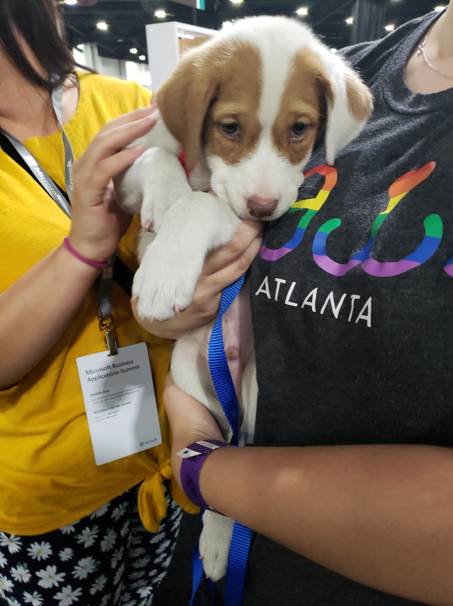

> Our hotel lobby

> View from my room during the day

> View from my room at night

> Moe, a dog from Atlanta PAWS rescue that stopped by the conference.

> Another dog, too shy to give me his name, that stopped by the conference

> External view of the Mercedes-Benz Stadium

> Neat falcon sculpture outside of the stadium

> A way too expensive Mercedes car outside of the stadium

> Team building tour of the new Atlanta football and soccer stadium

> Panorama of the stadium bowl as they prepare for an upcoming concert

> Reverse angle of the stadium bowl

> The locker room for the MLS Champion Atlanta United.